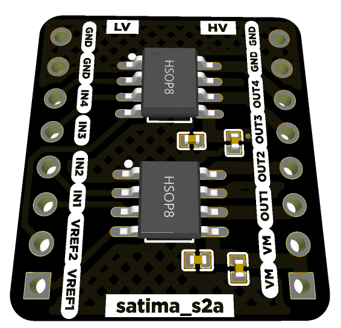
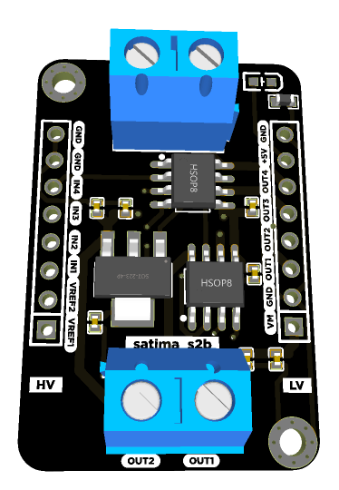

# Satima Motor Driver

Docs, Schematic and Board file for satima s1 and satima s2 motor drivers.

## Contents

In this repo you'll find the following items:

### [satima S1 motor driver](s1/)

This is a motor driver capable of driving 1 bidirectional or 2 unidirectional DC motors. There are two versions:

- [satima s1a](s1a/)
- [satima s1b](s1b/)

### [Satima S2 motor driver](s2/)

This is a motor driver capable of driving 2 bidirectional or 4 unidirectional DC motors. There are two versions:

- [satima s2a](s2a/)
- [satima s2b](s2b/)

## Support 0x6flab

We love designing, making, and releasing projects and products that empower others to learn and build amazing things! I do it because we believe it’s important to share knowledge and give back to the community as many have done before us. It helps us all learn and grow.

Please consider supporting me by buying some of my products from:

- [Nerokas](http://nerokas.co.ke/)
- [Pixel Electric](https://www.pixelelectric.com)
