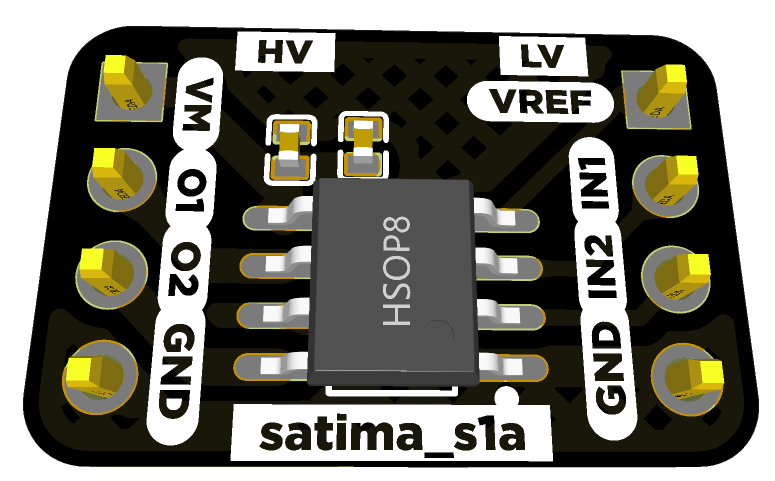

# Satima S1

Docs, Schematic and Board file for a the Satima S1 motor driver.

## Overview

The Satime S1 motor driver is a powerful motor driver based on the [DRV8870](datasheets/DRV8870.pdf) that can be used to driver either 1 bidirectional or 2 unidirectional DC motors. It is based on MOSFETs making it power efficient. It has a built in voltage supply based on the [AMS1117-5V](datasheets/ams1117.pdf) low dropout regulator.

The Satima S1 motor driver is an ideal motor driver compared to the L9298N motor driver.

## Features

- DRV8870
  - Wide 6.5-V to 15-V Operating Voltage
  - 3.6-A Peak Current Drive
  - PWM Control Interface
  - Low-Power Sleep Mode
- Drive 1 bidirectional or 2 DC unidirectional motors.
- In built power supply from motor voltage
- Power on LED
- Preference to use terminal block or header pins
- Solder pads to test the motor driver
- Small Package and Footprint

## Structure of this repository

- [/assets](assets/)
Contains the pictures and 3D model for the board
- [/datasheets](datasheets/)
Contains the relevant datasheets of the components used on the Boron
- [/pinout](pinout/)
Contains the pinout for the board
- [/production](production/)
Contains the manufacturing gerber files and bill of materials for the board
- [/schematic](schematic/)
Contains the schematic files
- [/src](src/)
Contains easy eda design files for bothe PCB and schematic

## Hardware datasheet

The complete datasheet for the Satima S1 is available [here](commingsoon).
