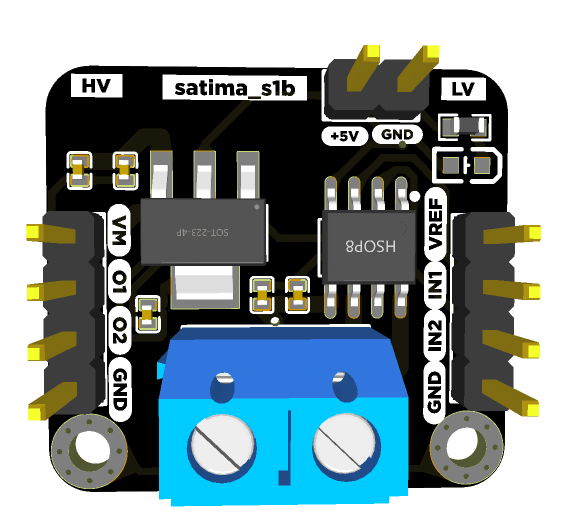

# satima s1b

Docs, Schematic and Board file for a the satima s1b motor driver.

## Overview

The satima s1b motor driver is a powerful motor driver based on the [DRV8870](datasheets/DRV8870.pdf) that can be used to driver either 1 bidirectional or 2 unidirectional DC motors. It is based on MOSFETs making it power efficient. It has a built in voltage supply based on the [AMS1117-5V](datasheets/ams1117.pdf) low dropout regulator.

The satima s1b motor driver is an ideal motor driver compared to the L9298N motor driver.

- KiCAD 6 Symbol. KiCAD 6 symbol [files](commingsoon) for the board that you can use when integrating one of them into one of your PCB designs.
- KiCAD 6 Footprint. KiCAD 6 footprint [files](commingsoon) for the board including both SMD and TH versions for the S1.
- EasyEda Symbol. EasyEda symbol [files](commingsoon) for the board that you can use when integrating one of them into one of your PCB designs.
- EasyEda Footprint. EasyEda footprint [files](commingsoon) for the board including both SMD and TH versions for the S1.
- Schematics. PDF [Schematics](commingsoon) for the board.
- Pin Reference Cards. The [pinout reference cards](pinout/pinout.svg) for each of the board.
- Fritzing Parts. Fritzing [parts](commingsoon) for the board.

## Features

- DRV8870
  - Wide 6.5-V to 15-V Operating Voltage
  - 3.6-A Peak Current Drive
  - PWM Control Interface
  - Low-Power Sleep Mode
- Drive 1 bidirectional or 2 DC unidirectional motors.
- In built power supply from motor voltage
- Power on LED
- Preference to use terminal block or header pins
- Solder pads to test the motor driver
- Small Package and Footprint

## Structure of this repository

- [/assets](assets/)
Contains the pictures and 3D model for the board
- [/datasheets](datasheets/)
Contains the relevant datasheets of the components used on the board
- [/pinout](pinout/)
Contains the pinout for the board
- [/production](production/)
Contains the manufacturing gerber files and bill of materials for the board
- [/schematic](schematic/)
Contains the schematic files
- [/src](src/)
Contains easy eda design files for bothe PCB and schematic

## Hardware datasheet

The complete datasheet for the satima s1b is available [here](commingsoon).
